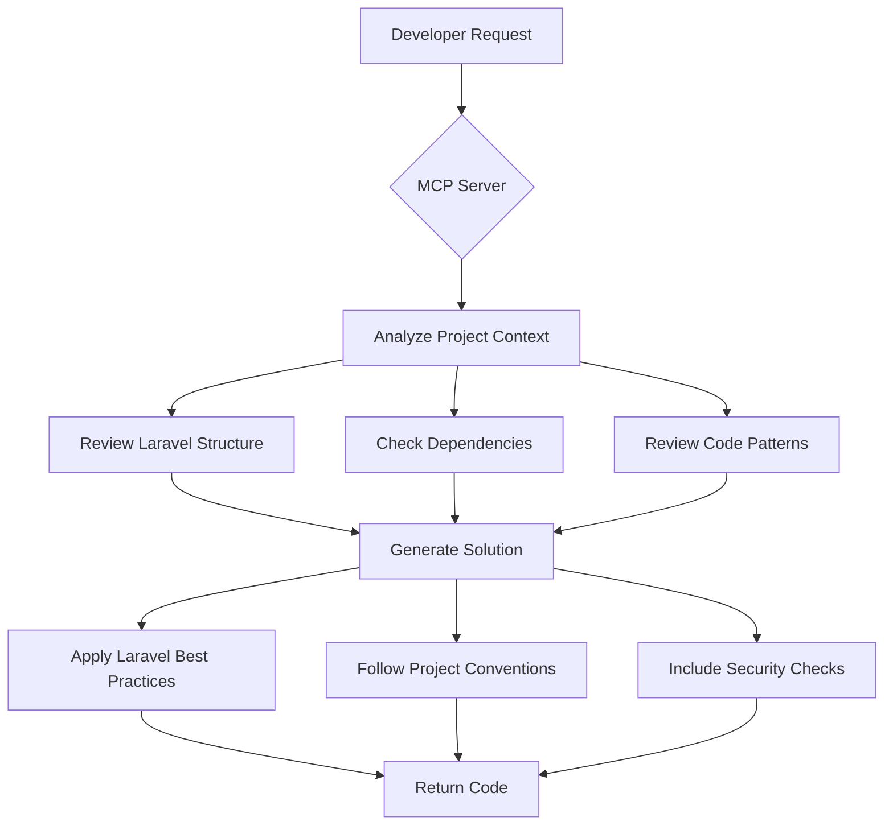

# GitHub Copilot Agent Configuration

## Project Overview

This is a Laravel 12 application using React 19 and Inertia.js as the primary stack. An existing React/Next.js application in the `reactapp` folder needs to be integrated into the Laravel/Inertia.js architecture.

**Important**: This project uses Laravel Boost MCP (Model Context Protocol) for enhanced AI-assisted development workflows.

## Technology Stack

- **Backend**: Laravel 12 (PHP 8.3+)
- **Frontend Framework**: React 19 with Inertia.js
- **Frontend Language**: TypeScript 5.x (strict mode enabled)
- **Build Tool**: Vite 5.x
- **Styling**: Tailwind CSS 3.x
- **Package Manager**: npm (preferred) / yarn
- **Type Checking**: TypeScript with strict configuration
- **AI Tools**: Laravel Boost MCP for development assistance
- **Legacy Code**: React/Next.js app in `reactapp/` folder (JavaScript - to be migrated to TypeScript)

## Laravel Boost MCP Integration

### What is Laravel Boost MCP?

Laravel Boost MCP is a Model Context Protocol server that provides AI assistants with deep Laravel project context, enabling intelligent code generation, refactoring, and project analysis.

### MCP Capabilities Available

When using AI assistants with Laravel Boost MCP, you can:

1. **Project Analysis**: Get comprehensive insights into project structure, dependencies, and architecture
2. **Code Generation**: Generate Laravel-specific code with proper context awareness
3. **Refactoring Assistance**: Intelligently refactor code while maintaining Laravel conventions
4. **Database Schema Analysis**: Understand and work with database structure
5. **Route Discovery**: Analyze and generate routes with proper middleware and validation
6. **Artisan Command Execution**: Run Laravel artisan commands through AI interface
7. **Dependency Management**: Analyze and manage Composer and NPM dependencies

### Using Laravel Boost MCP Commands

When working with AI assistants that support MCP, you can use these patterns:

```
# Project Structure Analysis
"Analyze the current Laravel project structure"
"Show me all registered routes"
"List all available artisan commands"

# Code Generation
"Generate a User repository with common queries"
"Create a service class for payment processing"
"Build a form request for user registration"

# Refactoring
"Refactor this controller to use service layer pattern"
"Convert this code to use Laravel collections"
"Optimize this query to prevent N+1 problems"

# Database Operations
"Show me the database schema"
"Generate a migration for adding user preferences"
"Create a seeder for test data"
```

### MCP-Enhanced Development Workflow

1. **Project Initialization**: MCP provides context about existing project structure
2. **Feature Development**: AI generates code that follows project conventions
3. **Code Review**: MCP helps identify anti-patterns and suggests improvements
4. **Documentation**: Auto-generate documentation based on actual code structure
5. **Testing**: Generate appropriate tests with proper setup and assertions

## Architecture Patterns

### Laravel Backend

#### Controller Best Practices
- Use single-action controllers for complex operations
- Return Inertia responses: `return Inertia::render('ComponentName', ['data' => $data]);`
- Use Form Requests for validation
- Follow RESTful conventions
- Keep controllers thin, move business logic to Services/Actions

```php
// Good Example - Controller delegates to Service
class UserController extends Controller
{
    public function __construct(
        private UserService $userService
    ) {}

    public function index()
    {
        return Inertia::render('Users/Index', [
            'users' => $this->userService->getPaginatedUsers(),
            'filters' => request()->only(['search', 'role']),
        ]);
    }

    public function store(StoreUserRequest $request)
    {
        $user = $this->userService->createUser($request->validated());

        return redirect()->route('users.show', $user)
            ->with('message', 'User created successfully.');
    }
}
```

#### Service Layer Pattern
- Create Services for complex business logic in `app/Services/`
- Use Actions for single-responsibility operations in `app/Actions/`
- Inject services via constructor dependency injection
- Services should be stateless and focused

```php
// Service Example
namespace App\Services;

use App\Models\User;
use Illuminate\Pagination\LengthAwarePaginator;
use Illuminate\Support\Facades\Hash;

class UserService
{
    public function getPaginatedUsers(int $perPage = 15): LengthAwarePaginator
    {
        return User::query()
            ->when(request('search'), function ($query, $search) {
                $query->where('name', 'like', "%{$search}%")
                    ->orWhere('email', 'like', "%{$search}%");
            })
            ->when(request('role'), function ($query, $role) {
                $query->where('role', $role);
            })
            ->select('id', 'name', 'email', 'role', 'created_at')
            ->latest()
            ->paginate($perPage)
            ->withQueryString()
            ->through(fn($user) => [
                'id' => $user->id,
                'name' => $user->name,
                'email' => $user->email,
                'role' => $user->role,
                'created_at' => $user->created_at->format('M d, Y'),
            ]);
    }

    public function createUser(array $data): User
    {
        return User::create([
            'name' => $data['name'],
            'email' => $data['email'],
            'password' => Hash::make($data['password']),
            'role' => $data['role'] ?? 'user',
        ]);
    }
}
```

#### Repository Pattern (Optional)
- Use repositories for complex data access logic in `app/Repositories/`
- Repositories abstract database operations
- Useful for applications with complex queries or multiple data sources

```php
// Repository Example
namespace App\Repositories;

use App\Models\User;
use Illuminate\Database\Eloquent\Collection;

class UserRepository
{
    public function findActiveUsers(): Collection
    {
        return User::where('is_active', true)
            ->with(['roles', 'profile'])
            ->get();
    }

    public function findByEmail(string $email): ?User
    {
        return User::where('email', $email)->first();
    }
}
```

#### Security Best Practices
- Always use CSRF protection (built-in with Inertia)
- Validate all inputs with Form Requests
- Use Laravel's authorization policies and gates
- Sanitize user inputs: `htmlspecialchars()`, `strip_tags()`
- Use parameterized queries (Eloquent does this by default)
- Implement rate limiting on sensitive routes
- Use `Hash::make()` for passwords, never store plain text
- Enable HTTPS in production
- Set secure session cookies in `config/session.php`
- Use `@can` directives and policies for authorization checks
- Implement proper API authentication with Laravel Sanctum
- Use signed URLs for temporary access to resources

```php
// Form Request Example with Authorization
namespace App\Http\Requests;

use Illuminate\Foundation\Http\FormRequest;
use Illuminate\Validation\Rules\Password;

class StoreUserRequest extends FormRequest
{
    public function authorize(): bool
    {
        return $this->user()->can('create', User::class);
    }

    public function rules(): array
    {
        return [
            'name' => ['required', 'string', 'max:255'],
            'email' => ['required', 'email', 'unique:users,email'],
            'password' => ['required', 'confirmed', Password::defaults()],
            'role' => ['required', 'in:user,admin,moderator'],
        ];
    }

    public function messages(): array
    {
        return [
            'role.in' => 'The selected role is invalid.',
        ];
    }
}
```

#### Database Best Practices
- Use migrations for all schema changes
- Add indexes to frequently queried columns
- Use eager loading to prevent N+1 queries: `->with(['relation'])`
- Use database transactions for multi-step operations
- Define fillable/guarded properties on models
- Use model events sparingly, prefer explicit actions
- Implement soft deletes where appropriate
- Use database seeders for test data

```php
// Migration Example with Indexes
public function up(): void
{
    Schema::create('posts', function (Blueprint $table) {
        $table->id();
        $table->foreignId('user_id')->constrained()->onDelete('cascade');
        $table->string('title');
        $table->text('body');
        $table->string('slug')->unique();
        $table->enum('status', ['draft', 'published', 'archived'])->default('draft');
        $table->timestamp('published_at')->nullable();
        $table->timestamps();
        $table->softDeletes();

        // Indexes for performance
        $table->index('status');
        $table->index('published_at');
        $table->index(['user_id', 'status']);
    });
}
```

### Inertia.js Integration

#### Page Components Location
- Store page components in `resources/js/Pages/`
- Use nested folders for organization: `Pages/Users/Index.jsx`, `Pages/Users/Show.jsx`
- Group related pages together (e.g., `Pages/Dashboard/`, `Pages/Settings/`)

#### Shared Data
- Configure shared data in `HandleInertiaRequests` middleware
- Share auth user, flash messages, and app-wide data
- Access via `usePage().props` in React components
- Use closures for data that should only be included when needed

```php
// app/Http/Middleware/HandleInertiaRequests.php
public function share(Request $request): array
{
    return array_merge(parent::share($request), [
        'auth' => [
            'user' => $request->user() ? [
                'id' => $request->user()->id,
                'name' => $request->user()->name,
                'email' => $request->user()->email,
                'avatar' => $request->user()->avatar_url,
                'permissions' => $request->user()->permissions,
            ] : null,
        ],
        'flash' => [
            'message' => fn() => $request->session()->get('message'),
            'error' => fn() => $request->session()->get('error'),
            'success' => fn() => $request->session()->get('success'),
        ],
        'errors' => fn() => $request->session()->get('errors')
            ? $request->session()->get('errors')->getBag('default')->getMessages()
            : (object) [],
        'app' => [
            'name' => config('app.name'),
        ],
    ]);
}
```

#### Forms and Data Mutations
- Use Inertia's `useForm` hook for form handling
- Include CSRF token automatically with Inertia
- Handle validation errors with `form.errors`
- Use `form.processing` for loading states
- Use `router.visit()` for navigation, `router.reload()` for refreshing
- Implement optimistic UI updates where appropriate

```jsx
// Advanced Form Component with Validation
import { useForm, usePage } from '@inertiajs/react';
import { useEffect } from 'react';

export default function CreateUser() {
    const { flash } = usePage().props;
    
    const form = useForm({
        name: '',
        email: '',
        password: '',
        password_confirmation: '',
        role: 'user',
    });

    useEffect(() => {
        if (flash.success) {
            // Handle success message
            console.log(flash.success);
        }
    }, [flash]);

    const submit = (e) => {
        e.preventDefault();
        form.post('/users', {
            onSuccess: () => {
                form.reset();
            },
            onError: (errors) => {
                console.error('Validation errors:', errors);
            },
            preserveScroll: true,
        });
    };

    return (
        <form onSubmit={submit} className="space-y-6">
            <div>
                <label htmlFor="name" className="block text-sm font-medium">
                    Name
                </label>
                <input
                    id="name"
                    type="text"
                    value={form.data.name}
                    onChange={e => form.setData('name', e.target.value)}
                    className={`mt-1 block w-full ${form.errors.name ? 'border-red-500' : ''}`}
                />
                {form.errors.name && (
                    <p className="mt-1 text-sm text-red-600">{form.errors.name}</p>
                )}
            </div>

            <div>
                <label htmlFor="email" className="block text-sm font-medium">
                    Email
                </label>
                <input
                    id="email"
                    type="email"
                    value={form.data.email}
                    onChange={e => form.setData('email', e.target.value)}
                    className={`mt-1 block w-full ${form.errors.email ? 'border-red-500' : ''}`}
                />
                {form.errors.email && (
                    <p className="mt-1 text-sm text-red-600">{form.errors.email}</p>
                )}
            </div>

            <button
                type="submit"
                disabled={form.processing}
                className="w-full py-2 px-4 bg-blue-600 text-white rounded disabled:opacity-50"
            >
                {form.processing ? 'Creating...' : 'Create User'}
            </button>
        </form>
    );
}
```

#### Partial Reloads
- Use `only` option to reload specific props
- Implement efficient data fetching for large datasets
- Use `preserveScroll` for better UX

```jsx
// Partial Reload Example
import { router } from '@inertiajs/react';

function handleFilter(filterValue) {
    router.visit('/users', {
        data: { filter: filterValue },
        only: ['users'], // Only reload users prop
        preserveScroll: true,
        preserveState: true,
    });
}
```

### React 19 & TypeScript Best Practices

#### TypeScript Configuration
```json
// tsconfig.json
{
  "compilerOptions": {
    "target": "ES2020",
    "useDefineForClassFields": true,
    "lib": ["ES2020", "DOM", "DOM.Iterable"],
    "module": "ESNext",
    "skipLibCheck": true,
    "moduleResolution": "bundler",
    "allowImportingTsExtensions": true,
    "resolveJsonModule": true,
    "isolatedModules": true,
    "noEmit": true,
    "jsx": "react-jsx",
    "strict": true,
    "noUnusedLocals": true,
    "noUnusedParameters": true,
    "noFallthroughCasesInSwitch": true,
    "baseUrl": ".",
    "paths": {
      "@/*": ["./resources/js/*"],
      "@components/*": ["./resources/js/Components/*"],
      "@pages/*": ["./resources/js/Pages/*"],
      "@hooks/*": ["./resources/js/Hooks/*"],
      "@types/*": ["./resources/js/types/*"]
    }
  },
  "include": ["resources/js/**/*.ts", "resources/js/**/*.tsx", "resources/js/**/*.d.ts"],
  "references": [{ "path": "./tsconfig.node.json" }]
}
```

#### Component Structure with TypeScript
- Use functional components with proper TypeScript types
- Create reusable components in `resources/js/Components/`
- Define interfaces/types in `resources/js/types/`
- Use composition over prop drilling
- Always provide explicit types for props and state

```tsx
// resources/js/types/index.ts
export interface User {
  id: number;
  name: string;
  email: string;
  avatar?: string;
  created_at: string;
  updated_at: string;
}

export interface PageProps<T = {}> {
  auth: {
    user: User | null;
  };
  flash: {
    message?: string;
    error?: string;
    success?: string;
  };
  errors: Record<string, string>;
} & T;

export interface PaginatedData<T> {
  data: T[];
  current_page: number;
  last_page: number;
  per_page: number;
  total: number;
  links: {
    first: string | null;
    last: string | null;
    prev: string | null;
    next: string | null;
  };
}
```

```tsx
// Good Component Structure with TypeScript
import { memo } from 'react';
import { Head } from '@inertiajs/react';
import type { PageProps, User, PaginatedData } from '@/types';
import AuthenticatedLayout from '@/Layouts/AuthenticatedLayout';

interface UserIndexProps extends PageProps {
  users: PaginatedData<User>;
  filters: {
    search?: string;
    role?: string;
  };
}

function UserIndex({ users, filters }: UserIndexProps) {
  return (
    <AuthenticatedLayout>
      <Head title="Users" />
      <div className="py-12">
        <div className="max-w-7xl mx-auto sm:px-6 lg:px-8">
          {/* Content */}
        </div>
      </div>
    </AuthenticatedLayout>
  );
}

export default memo(UserIndex);
```

```tsx
// Reusable Component with TypeScript
import { forwardRef, InputHTMLAttributes } from 'react';

interface InputProps extends InputHTMLAttributes<HTMLInputElement> {
  label?: string;
  error?: string;
  className?: string;
}

const Input = forwardRef<HTMLInputElement, InputProps>(({ 
  label, 
  error, 
  className = '', 
  ...props 
}, ref) => {
  return (
    <div className="mb-4">
      {label && (
        <label className="block text-sm font-medium mb-1">
          {label}
        </label>
      )}
      <input
        ref={ref}
        className={`
          w-full px-3 py-2 border rounded-md
          ${error ? 'border-red-500' : 'border-gray-300'}
          ${className}
        `}
        {...props}
      />
      {error && (
        <p className="mt-1 text-sm text-red-600">{error}</p>
      )}
    </div>
  );
});

Input.displayName = 'Input';

export default Input;
```

#### State Management with TypeScript
- Use `useState` with proper type inference or explicit types
- Use `useContext` with typed context
- Consider Zustand with TypeScript for complex state
- Keep state close to where it's used

```tsx
// Context Example with TypeScript
import { createContext, useContext, useState, useEffect, ReactNode } from 'react';

type Theme = 'light' | 'dark';

interface ThemeContextType {
  theme: Theme;
  toggleTheme: () => void;
}

const ThemeContext = createContext<ThemeContextType | undefined>(undefined);

interface ThemeProviderProps {
  children: ReactNode;
}

export function ThemeProvider({ children }: ThemeProviderProps) {
  const [theme, setTheme] = useState<Theme>(() => {
    const stored = localStorage.getItem('theme');
    return (stored === 'light' || stored === 'dark') ? stored : 'light';
  });

  useEffect(() => {
    localStorage.setItem('theme', theme);
    document.documentElement.classList.toggle('dark', theme === 'dark');
  }, [theme]);

  const toggleTheme = () => {
    setTheme(prev => prev === 'light' ? 'dark' : 'light');
  };

  return (
    <ThemeContext.Provider value={{ theme, toggleTheme }}>
      {children}
    </ThemeContext.Provider>
  );
}

export function useTheme(): ThemeContextType {
  const context = useContext(ThemeContext);
  if (!context) {
    throw new Error('useTheme must be used within ThemeProvider');
  }
  return context;
}
```

```tsx
// Zustand Store with TypeScript
import { create } from 'zustand';

interface CartItem {
  id: number;
  name: string;
  price: number;
  quantity: number;
}

interface CartState {
  items: CartItem[];
  addItem: (item: CartItem) => void;
  removeItem: (id: number) => void;
  updateQuantity: (id: number, quantity: number) => void;
  clearCart: () => void;
  total: () => number;
}

export const useCartStore = create<CartState>((set, get) => ({
  items: [],
  
  addItem: (item) => set((state) => ({
    items: [...state.items, item]
  })),
  
  removeItem: (id) => set((state) => ({
    items: state.items.filter(item => item.id !== id)
  })),
  
  updateQuantity: (id, quantity) => set((state) => ({
    items: state.items.map(item => 
      item.id === id ? { ...item, quantity } : item
    )
  })),
  
  clearCart: () => set({ items: [] }),
  
  total: () => {
    const { items } = get();
    return items.reduce((sum, item) => sum + (item.price * item.quantity), 0);
  }
}));
```

#### Performance with TypeScript
- Use `React.memo()` with proper type annotations
- Implement code splitting with `lazy()` and `Suspense`
- Use typed `useCallback` and `useMemo`
- Avoid inline function definitions in render

```tsx
// Performance Optimized Component with TypeScript
import { memo, useCallback, useMemo, FC } from 'react';
import { router } from '@inertiajs/react';
import type { User } from '@/types';

interface UserListProps {
  users: User[];
  filters: {
    role?: string;
    search?: string;
  };
}

const UserList: FC<UserListProps> = ({ users, filters }) => {
  const filteredUsers = useMemo(() => {
    return users.filter(user => {
      if (filters.role && user.role !== filters.role) return false;
      if (filters.search) {
        const searchLower = filters.search.toLowerCase();
        return user.name.toLowerCase().includes(searchLower) ||
               user.email.toLowerCase().includes(searchLower);
      }
      return true;
    });
  }, [users, filters]);

  const handleDelete = useCallback((userId: number) => {
    if (confirm('Are you sure?')) {
      router.delete(`/users/${userId}`);
    }
  }, []);

  return (
    <div>
      {filteredUsers.map(user => (
        <UserCard 
          key={user.id} 
          user={user} 
          onDelete={handleDelete}
        />
      ))}
    </div>
  );
};

export default memo(UserList);
```

#### Custom Hooks with TypeScript
- Extract custom hooks for reusable logic in `resources/js/Hooks/`
- Follow hooks rules (only call at top level)
- Name custom hooks with `use` prefix
- Provide proper type definitions

```tsx
// resources/js/Hooks/useDebounce.ts
import { useState, useEffect } from 'react';

export function useDebounce<T>(value: T, delay: number = 500): T {
  const [debouncedValue, setDebouncedValue] = useState<T>(value);

  useEffect(() => {
    const handler = setTimeout(() => {
      setDebouncedValue(value);
    }, delay);

    return () => {
      clearTimeout(handler);
    };
  }, [value, delay]);

  return debouncedValue;
}

// Usage
function SearchComponent() {
  const [search, setSearch] = useState<string>('');
  const debouncedSearch = useDebounce(search, 300);

  useEffect(() => {
    if (debouncedSearch) {
      router.visit('/search', {
        data: { q: debouncedSearch },
        preserveState: true,
      });
    }
  }, [debouncedSearch]);

  return (
    <input
      value={search}
      onChange={e => setSearch(e.target.value)}
      placeholder="Search..."
    />
  );
}
```

```tsx
// resources/js/Hooks/useForm.ts
import { useState, useCallback } from 'react';

interface UseFormOptions<T> {
  initialValues: T;
  onSubmit: (values: T) => void | Promise<void>;
  validate?: (values: T) => Partial<Record<keyof T, string>>;
}

interface UseFormReturn<T> {
  values: T;
  errors: Partial<Record<keyof T, string>>;
  isSubmitting: boolean;
  handleChange: (name: keyof T, value: any) => void;
  handleSubmit: (e: React.FormEvent) => void;
  reset: () => void;
  setFieldError: (name: keyof T, error: string) => void;
}

export function useForm<T extends Record<string, any>>({
  initialValues,
  onSubmit,
  validate
}: UseFormOptions<T>): UseFormReturn<T> {
  const [values, setValues] = useState<T>(initialValues);
  const [errors, setErrors] = useState<Partial<Record<keyof T, string>>>({});
  const [isSubmitting, setIsSubmitting] = useState(false);

  const handleChange = useCallback((name: keyof T, value: any) => {
    setValues(prev => ({ ...prev, [name]: value }));
    // Clear error when user starts typing
    if (errors[name]) {
      setErrors(prev => {
        const newErrors = { ...prev };
        delete newErrors[name];
        return newErrors;
      });
    }
  }, [errors]);

  const handleSubmit = useCallback(async (e: React.FormEvent) => {
    e.preventDefault();
    
    // Validate if validator provided
    if (validate) {
      const validationErrors = validate(values);
      if (Object.keys(validationErrors).length > 0) {
        setErrors(validationErrors);
        return;
      }
    }

    setIsSubmitting(true);
    try {
      await onSubmit(values);
    } catch (error) {
      console.error('Form submission error:', error);
    } finally {
      setIsSubmitting(false);
    }
  }, [values, validate, onSubmit]);

  const reset = useCallback(() => {
    setValues(initialValues);
    setErrors({});
    setIsSubmitting(false);
  }, [initialValues]);

  const setFieldError = useCallback((name: keyof T, error: string) => {
    setErrors(prev => ({ ...prev, [name]: error }));
  }, []);

  return {
    values,
    errors,
    isSubmitting,
    handleChange,
    handleSubmit,
    reset,
    setFieldError
  };
}
```

#### Inertia.js with TypeScript
```tsx
// Typed Inertia Props
import { PageProps as InertiaPageProps } from '@inertiajs/core';

declare global {
  namespace App {
    interface PageProps extends InertiaPageProps {
      auth: {
        user: User | null;
      };
      flash: {
        message?: string;
        error?: string;
        success?: string;
      };
    }
  }
}

// Using typed props
import { usePage } from '@inertiajs/react';

function MyComponent() {
  const { auth, flash } = usePage<App.PageProps>().props;
  
  return (
    <div>
      {auth.user && <p>Welcome, {auth.user.name}</p>}
      {flash.message && <p>{flash.message}</p>}
    </div>
  );
}
```

```tsx
// Typed Form Component with Inertia
import { useForm } from '@inertiajs/react';
import type { FormEventHandler } from 'react';

interface UserFormData {
  name: string;
  email: string;
  password: string;
  password_confirmation: string;
  role: 'user' | 'admin' | 'moderator';
}

export default function CreateUser() {
  const form = useForm<UserFormData>({
    name: '',
    email: '',
    password: '',
    password_confirmation: '',
    role: 'user',
  });

  const submit: FormEventHandler = (e) => {
    e.preventDefault();
    form.post('/users', {
      onSuccess: () => {
        form.reset();
      },
      onError: (errors) => {
        console.error('Validation errors:', errors);
      },
      preserveScroll: true,
    });
  };

  return (
    <form onSubmit={submit} className="space-y-6">
      <div>
        <label htmlFor="name" className="block text-sm font-medium">
          Name
        </label>
        <input
          id="name"
          type="text"
          value={form.data.name}
          onChange={e => form.setData('name', e.target.value)}
          className={`mt-1 block w-full ${form.errors.name ? 'border-red-500' : ''}`}
        />
        {form.errors.name && (
          <p className="mt-1 text-sm text-red-600">{form.errors.name}</p>
        )}
      </div>

      <button
        type="submit"
        disabled={form.processing}
        className="w-full py-2 px-4 bg-blue-600 text-white rounded disabled:opacity-50"
      >
        {form.processing ? 'Creating...' : 'Create User'}
      </button>
    </form>
  );
}
```
```

### Security Guidelines

#### Frontend Security
- Never store sensitive data in localStorage
- Sanitize user-generated content before rendering
- Use `dangerouslySetInnerHTML` only when absolutely necessary and with sanitized content
- Validate all inputs on both client and server
- Don't expose API keys or secrets in frontend code
- Implement proper CORS configuration
- Use Content Security Policy headers

```jsx
// Sanitization Example
import DOMPurify from 'dompurify';

function SafeContent({ html }) {
    const sanitized = DOMPurify.sanitize(html, {
        ALLOWED_TAGS: ['p', 'br', 'strong', 'em', 'ul', 'ol', 'li'],
    });

    return (
        <div dangerouslySetInnerHTML={{ __html: sanitized }} />
    );
}
```

#### Backend Security
- Use Laravel Sanctum for API authentication
- Implement proper authorization checks on every route
- Use `throttle` middleware on authentication routes
- Enable SQL injection protection (Eloquent default)
- Validate file uploads (type, size, content)
- Use `SameSite` cookie attribute
- Implement Content Security Policy headers
- Use Laravel's encryption for sensitive data
- Implement audit logging for sensitive operations

```php
// Route Security Example with Middleware
Route::middleware(['auth', 'verified'])->group(function () {
    Route::get('/dashboard', [DashboardController::class, 'index'])
        ->name('dashboard');
    
    // Admin routes with authorization
    Route::middleware('can:access-admin-panel')->prefix('admin')->group(function () {
        Route::resource('users', UserController::class);
        Route::resource('posts', PostController::class);
    });
    
    // API routes with rate limiting
    Route::middleware('throttle:60,1')->prefix('api')->group(function () {
        Route::get('/user', [ApiUserController::class, 'show']);
    });
});

// Authentication routes with throttling
Route::middleware('throttle:5,1')->group(function () {
    Route::post('/login', [AuthController::class, 'login']);
    Route::post('/register', [AuthController::class, 'register']);
});
```

## Integrating Existing React/Next.js App

### Migration Strategy

1. **Analyze Dependencies**: Review `reactapp/package.json` for dependencies that need to be merged
2. **Component Migration**: Move reusable components to `resources/js/Components/`
3. **Page Migration**: Convert Next.js pages to Inertia page components in `resources/js/Pages/`
4. **API Routes**: Convert Next.js API routes to Laravel controllers/routes
5. **State Management**: Migrate state to React Context or Inertia shared props
6. **Routing**: Replace Next.js router with Inertia router (`router.visit()`)
7. **Image Optimization**: Move to Laravel/Vite asset handling
8. **Environment Variables**: Migrate to Laravel `.env` file

### Next.js to Inertia.js Conversion Guide

#### Routing
```jsx
// Next.js Pattern
import { useRouter } from 'next/router';
import Link from 'next/link';

export default function Page() {
    const router = useRouter();
    const handleClick = () => router.push('/about');
    
    return (
        <>
            <Link href="/about">
                <a>About</a>
            </Link>
            <button onClick={handleClick}>Go to About</button>
        </>
    );
}

// Inertia.js Pattern
import { router, Link } from '@inertiajs/react';

export default function Page() {
    const handleClick = () => router.visit('/about');
    
    return (
        <>
            <Link href="/about">
                About
            </Link>
            <button onClick={handleClick}>Go to About</button>
        </>
    );
}
```

#### Data Fetching Migration

```jsx
// Next.js getServerSideProps
export async function getServerSideProps(context) {
    const res = await fetch('https://api.example.com/data');
    const data = await res.json();
    
    return { 
        props: { 
            data,
            user: context.req.user 
        } 
    };
}

export default function Page({ data, user }) {
    return <div>{data.title}</div>;
}

// Laravel/Inertia Pattern (Controller)
public function show()
{
    return Inertia::render('Page', [
        'data' => $this->dataService->getData(),
        'user' => auth()->user(),
    ]);
}

// React Component receives data as props
export default function Page({ data, user }) {
    // data is available immediately
    return <div>{data.title}</div>;
}
```

#### API Routes Migration
```javascript
// Next.js API Route: pages/api/users.js
export default async function handler(req, res) {
    if (req.method === 'POST') {
        const user = await createUser(req.body);
        res.status(201).json(user);
    }
}

// Laravel Controller
class UserController extends Controller
{
    public function store(StoreUserRequest $request)
    {
        $user = $this->userService->createUser($request->validated());
        
        // For Inertia
        return redirect()->route('users.show', $user);
        
        // For API
        // return response()->json($user, 201);
    }
}
```

#### Image Handling
```jsx
// Next.js Image
import Image from 'next/image';

<Image 
    src="/images/logo.png" 
    width={200} 
    height={100}
    alt="Logo" 
/>

// Laravel/Vite Pattern


// Or with Vite import
import logo from '@/assets/logo.png';

```

### Asset Management

- Move public assets from `reactapp/public/` to Laravel's `public/` directory
- Update image imports to use Laravel's asset structure
- Use Vite's asset handling for images: `import logo from '@/assets/logo.png'`
- Configure Vite aliases in `vite.config.js`

```javascript
// vite.config.js
import { defineConfig } from 'vite';
import laravel from 'laravel-vite-plugin';
import react from '@vitejs/plugin-react';
import path from 'path';

export default defineConfig({
    plugins: [
        laravel({
            input: 'resources/js/app.jsx',
            refresh: true,
        }),
        react(),
    ],
    resolve: {
        alias: {
            '@': path.resolve(__dirname, './resources/js'),
            '@components': path.resolve(__dirname, './resources/js/Components'),
            '@pages': path.resolve(__dirname, './resources/js/Pages'),
            '@hooks': path.resolve(__dirname, './resources/js/Hooks'),
        },
    },
});
```

## File Structure

```
laravel-app/
├── app/
│   ├── Actions/              # Single-purpose action classes
│   ├── Http/
│   │   ├── Controllers/      # Keep thin, delegate to services
│   │   ├── Requests/         # Form validation requests
│   │   ├── Middleware/       # Custom middleware
│   │   └── Resources/        # API resources (if needed)
│   ├── Models/               # Eloquent models
│   ├── Services/             # Business logic layer
│   ├── Repositories/         # Data access layer (optional)
│   ├── Policies/             # Authorization policies
│   └── Providers/            # Service providers
├── bootstrap/
├── config/                   # Configuration files
├── database/
│   ├── factories/            # Model factories
│   ├── migrations/           # Database migrations
│   └── seeders/              # Database seeders
├── public/                   # Public assets
│   ├── build/                # Vite build output
│   └── images/               # Static images
├── resources/
│   ├── css/                  # Global styles
│   └── js/
│       ├── Components/       # Reusable React components
│       │   ├── UI/           # UI primitives (Button, Input, etc.)
│       │   └── Features/     # Feature-specific components
│       ├── Hooks/            # Custom React hooks
│       ├── Layouts/          # Layout components
│       ├── Pages/            # Inertia page components
│       │   ├── Auth/         # Authentication pages
│       │   ├── Dashboard/    # Dashboard pages
│       │   └── Users/        # User management pages
│       ├── Utils/            # Utility functions
│       └── app.jsx           # Main entry point
├── routes/
│   ├── web.php               # Web routes (Inertia)
│   ├── api.php               # API routes (if needed)
│   └── console.php           # Artisan commands
├── storage/                  # Application storage
├── tests/
│   ├── Feature/              # Integration tests
│   └── Unit/                 # Unit tests
├── reactapp/                 # Legacy Next.js app (to be migrated)
│   ├── pages/                # Next.js pages (migrate to resources/js/Pages)
│   ├── components/           # React components (migrate to resources/js/Components)
│   └── public/               # Assets (migrate to public/)
├── .env                      # Environment variables
├── composer.json             # PHP dependencies
├── package.json              # JavaScript dependencies
├── vite.config.js            # Vite configuration
├── tailwind.config.js        # Tailwind CSS configuration
└── agent.md                  # This file (GitHub Copilot context)
```

## Code Quality Standards

### Laravel
- Follow PSR-12 coding standards
- Use Laravel Pint for code formatting: `./vendor/bin/pint`
- Write feature tests for critical paths
- Use meaningful method and variable names
- Add PHPDoc blocks to public methods
- Keep methods under 20 lines when possible
- Use type hints for parameters and return types
- Follow SOLID principles

```php
// Good Example with Type Hints and DocBlocks
/**
 * Create a new user with the given attributes.
 *
 * @param  array<string, mixed>  $attributes
 * @return User
 * @throws \Illuminate\Validation\ValidationException
 */
public function createUser(array $attributes): User
{
    return User::create($attributes);
}
```
### React/TypeScript Code Quality Standards

#### TypeScript Standards
- Enable strict mode in `tsconfig.json`
- Use explicit return types for functions
- Prefer interfaces over types for object shapes
- Use type guards for runtime type checking
- Avoid `any` type - use `unknown` when type is truly unknown
- Use utility types (`Partial`, `Pick`, `Omit`, `Record`) appropriately

``tsx
// Good TypeScript Practices
import type { FC, ReactNode } from 'react';

// Use interface for component props
interface ButtonProps {
  children: ReactNode;
  variant?: 'primary' | 'secondary' | 'danger';
  size?: 'sm' | 'md' | 'lg';
  disabled?: boolean;
  onClick?: () => void;
}

// Explicit return type
const Button: FC = ({ 
  children, 
  variant = 'primary',
  size = 'md',
  disabled = false,
  onClick 
}): JSX.Element => {
  return (
    
      {children}
    
  );
};

// Type guard example
function isUser(obj: unknown): obj is User {
  return (
    typeof obj === 'object' &&
    obj !== null &&
    'id' in obj &&
    'name' in obj &&
    'email' in obj
  );
}

// Using utility types
type UserUpdate = Partial; // All properties optional
type UserPreview = Pick; // Only specific props
type UserWithoutPassword = Omit; // Exclude specific props
```

#### File Extensions
- Use `.tsx` for React components with JSX
- Use `.ts` for utilities, types, and non-component logic
- Use `.d.ts` for type declaration files

```
resources/js/
├── Components/
│   ├── Button.tsx           # React component
│   └── Input.tsx
├── Hooks/
│   └── useDebounce.ts       # Custom hook (no JSX)
├── Utils/
│   └── formatters.ts        # Utility functions
└── types/
    ├── index.ts             # Type exports
    └── inertia.d.ts      

### React
- Use ESLint with TypeScript rules
- Use Prettier for consistent formatting
- Write descriptive component and prop names
- Always provide TypeScript types/interfaces
- Keep components under 200 lines
- Extract complex logic to custom hooks
- Follow component naming conventions (PascalCase)
- Export types alongside components

```javascript
// .eslintrc.cjs
module.exports = {
  root: true,
  env: {
    browser: true,
    es2020: true
  },
  extends: [
    'eslint:recommended',
    'plugin:@typescript-eslint/recommended',
    'plugin:react/recommended',
    'plugin:react-hooks/recommended',
    'plugin:react/jsx-runtime'
  ],
  ignorePatterns: ['dist', '.eslintrc.cjs'],
  parser: '@typescript-eslint/parser',
  parserOptions: {
    ecmaVersion: 'latest',
    sourceType: 'module',
    project: ['./tsconfig.json', './tsconfig.node.json'],
    tsconfigRootDir: __dirname
  },
  plugins: ['react-refresh', '@typescript-eslint'],
  settings: {
    react: {
      version: 'detect'
    }
  },
  rules: {
    'react-refresh/only-export-components': [
      'warn',
      { allowConstantExport: true }
    ],
    '@typescript-eslint/no-unused-vars': 'warn',
    '@typescript-eslint/no-explicit-any': 'error',
    '@typescript-eslint/explicit-module-boundary-types': 'off',
    '@typescript-eslint/explicit-function-return-type': 'off',
    'react/prop-types': 'off' // Not needed with TypeScript
  }
};
```

## Testing Requirements

### Backend Tests

```php
// Feature Test Example
use App\Models\User;
use function Pest\Laravel\{actingAs, assertDatabaseHas};

test('authenticated user can create a post', function () {
    $user = User::factory()->create();
    
    actingAs($user)
        ->post('/posts', [
            'title' => 'Test Post',
            'body' => 'This is a test.',
            'status' => 'draft',
        ])
        ->assertRedirect(route('posts.index'))
        ->assertSessionHas('message', 'Post created successfully.');
    
    assertDatabaseHas('posts', [
        'title' => 'Test Post',
        'user_id' => $user->id,
        'status' => 'draft',
    ]);
});

test('guest cannot create a post', function () {
    $this->post('/posts', [
        'title' => 'Test Post',
        'body' => 'This is a test.',
    ])
    ->assertRedirect(route('login'));
});

test('post creation requires valid data', function () {
    $user = User::factory()->create();
    
    actingAs($user)
        ->post('/posts', [
            'title' => '', // Invalid
            'body' => 'Test',
        ])
        ->assertSessionHasErrors(['title']);
});
```

### Frontend Tests
- Use Vitest for unit testing React components
- Test user interactions and form submissions
- Mock Inertia router for navigation tests
- Test error handling and loading states

```javascript
// Component Test Example
import { render, screen, fireEvent, waitFor } from '@testing-library/react';
import { describe, it, expect, vi } from 'vitest';
import UserForm from '@/Components/UserForm';

describe('UserForm', () => {
    it('renders form fields correctly', () => {
        render(<UserForm />);
        
        expect(screen.getByLabelText(/name/i)).toBeInTheDocument();
        expect(screen.getByLabelText(/email/i)).toBeInTheDocument();
        expect(screen.getByRole('button', { name: /submit/i })).toBeInTheDocument();
    });

    it('validates required fields', async () => {
        const onSubmit = vi.fn();
        render(<UserForm onSubmit={onSubmit} />);
        
        fireEvent.click(screen.getByRole('button', { name: /submit/i }));
        
        await waitFor(() => {
            expect(screen.getByText(/name is required/i)).toBeInTheDocument();
        });
    });

    it('submits form with valid data', async () => {
        const onSubmit = vi.fn();
        render(<UserForm onSubmit={onSubmit} />);
        
        fireEvent.change(screen.getByLabelText(/name/i), {
            target: { value: 'John Doe' }
        });
        fireEvent.change(screen.getByLabelText(/email/i), {
            target: { value: 'john@example.com' }
        });
        
        fireEvent.click(screen.getByRole('button', { name: /submit/i }));
        
        await waitFor(() => {
            expect(onSubmit).toHaveBeenCalledWith({
                name: 'John Doe',
                email: 'john@example.com'
            });
        });
    });
});
```

## Environment Configuration

### Required Environment Variables
```env
# Application
APP_NAME=Laravel
APP_ENV=local
APP_KEY=
APP_DEBUG=true
APP_URL=http://localhost

# Database
DB_CONNECTION=mysql
DB_HOST=127.0.0.1
DB_PORT=3306
DB_DATABASE=laravel
DB_USERNAME=root
DB_PASSWORD=

# Session & Cache
SESSION_DRIVER=database
SESSION_LIFETIME=120
SESSION_SECURE_COOKIE=true
SESSION_SAME_SITE=lax
CACHE_DRIVER=redis

# Redis (for queue and cache)
REDIS_HOST=127.0.0.1
REDIS_PASSWORD=null
REDIS_PORT=6379

# Queue
QUEUE_CONNECTION=redis

# Mail
MAIL_MAILER=smtp
MAIL_HOST=mailpit
MAIL_PORT=1025
MAIL_USERNAME=null
MAIL_PASSWORD=null
MAIL_ENCRYPTION=null
MAIL_FROM_ADDRESS="hello@example.com"
MAIL_FROM_NAME="${APP_NAME}"

# Sanctum (for API authentication)
SANCTUM_STATEFUL_DOMAINS=localhost,localhost:3000,127.0.0.1,127.0.0.1:8000

# Vite
VITE_APP_NAME="${APP_NAME}"
VITE_PUSHER_APP_KEY="${PUSHER_APP_KEY}"
VITE_PUSHER_HOST="${PUSHER_HOST}"
VITE_PUSHER_PORT="${PUSHER_PORT}"
VITE_PUSHER_SCHEME="${PUSHER_SCHEME}"
VITE_PUSHER_APP_CLUSTER="${PUSHER_APP_CLUSTER}"
```

### Production Environment
```env
APP_ENV=production
APP_DEBUG=false
APP_URL=https://yourdomain.com

SESSION_SECURE_COOKIE=true
SESSION_SAME_SITE=strict

# Use stronger cache/session drivers
CACHE_DRIVER=redis
SESSION_DRIVER=redis
QUEUE_CONNECTION=redis

# Enable logging
LOG_CHANNEL=stack
LOG_LEVEL=error
```

## Common Commands

### Development
```bash
# Start development server
php artisan serve

# Start Vite dev server
npm run dev

# Run migrations
php artisan migrate

# Run seeders
php artisan db:seed

# Clear caches
php artisan cache:clear
php artisan config:clear
php artisan route:clear
php artisan view:clear

# Laravel REPL
php artisan tinker

# Watch tests
php artisan test --watch
```

### Code Quality
```bash
# Format PHP code
./vendor/bin/pint

# Lint JavaScript/React
npm run lint

# Fix linting issues
npm run lint:fix

# Run tests
php artisan test

# Run tests with coverage
php artisan test --coverage

# Type check (if using TypeScript)
npm run type-check

# Build for production
npm run build
```

### Laravel Boost MCP Commands
```bash
# Analyze project structure
# Use MCP-enabled AI: "Analyze this Laravel project"

# Generate code with context
# Use MCP-enabled AI: "Generate a complete CRUD for products"

# Refactor existing code
# Use MCP-enabled AI: "Refactor this controller to use repository pattern"

# Database operations
# Use MCP-enabled AI: "Show me the current database schema"
# Use MCP-enabled AI: "Generate a migration for user preferences"
```

### Migration Commands
```bash
# Migrate Next.js components to Inertia
# 1. Analyze Next.js app structure
cd reactapp && ls -R

# 2. Copy components to Laravel structure
cp -r reactapp/components/* resources/js/Components/

# 3. Convert pages to Inertia format
# Use MCP-enabled AI: "Convert this Next.js page to Inertia format"

# 4. Test migrated components
npm run dev
php artisan serve
```

## Git Workflow & Version Control

### Branching Strategy
```bash
# Main branches
main/master    # Production-ready code
develop        # Integration branch

# Feature branches
feature/user-authentication
feature/post-management

# Bugfix branches
bugfix/login-validation
bugfix/image-upload

# Hotfix branches
hotfix/security-patch
```

### Commit Message Format
```
type(scope): subject

body

footer
```

**Types**: feat, fix, docs, style, refactor, test, chore

**Examples**:
```
feat(auth): add two-factor authentication
fix(posts): resolve N+1 query issue in post listing
refactor(users): convert to service layer pattern
docs(readme): update installation instructions
```

### Pre-commit Hooks
```json
// package.json
{
  "husky": {
    "hooks": {
      "pre-commit": "lint-staged"
    }
  },
  "lint-staged": {
    "*.php": [
      "./vendor/bin/pint",
      "git add"
    ],
    "*.{js,jsx}": [
      "eslint --fix",
      "git add"
    ]
  }
}
```

## Performance Optimization

### Backend Optimization
```php
// Query Optimization
// Bad: N+1 Query
$posts = Post::all();
foreach ($posts as $post) {
    echo $post->user->name; // Extra query per post
}

// Good: Eager Loading
$posts = Post::with('user')->get();
foreach ($posts as $post) {
    echo $post->user->name; // No extra queries
}

// Caching Expensive Operations
use Illuminate\Support\Facades\Cache;

public function getPopularPosts()
{
    return Cache::remember('popular_posts', 3600, function () {
        return Post::withCount('likes')
            ->orderBy('likes_count', 'desc')
            ->take(10)
            ->get();
    });
}

// Database Indexing
Schema::table('posts', function (Blueprint $table) {
    $table->index('user_id');
    $table->index('published_at');
    $table->index(['status', 'published_at']);
});
```

### Frontend Optimization
```jsx
// Code Splitting
import { lazy, Suspense } from 'react';

const HeavyComponent = lazy(() => import('./HeavyComponent'));

function App() {
    return (
        <Suspense fallback={<div>Loading...</div>}>
            <HeavyComponent />
        </Suspense>
    );
}

// Image Optimization
// Use appropriate image formats and sizes


// Debounced Search
import { useDebounce } from '@/Hooks/useDebounce';

function SearchBar() {
    const [query, setQuery] = useState('');
    const debouncedQuery = useDebounce(query, 300);
    
    useEffect(() => {
        if (debouncedQuery) {
            router.visit('/search', {
                data: { q: debouncedQuery },
                preserveState: true,
            });
        }
    }, [debouncedQuery]);
    
    return <input value={query} onChange={e => setQuery(e.target.value)} />;
}
```

## Deployment Guidelines

### Pre-deployment Checklist
- [ ] All tests passing
- [ ] Environment variables configured
- [ ] Database migrations tested
- [ ] Assets built for production (`npm run build`)
- [ ] Cache cleared
- [ ] SSL certificate installed
- [ ] Backups configured
- [ ] Error logging configured
- [ ] Security headers configured

### Production Deployment
```bash
# 1. Pull latest code
git pull origin main

# 2. Install dependencies
composer install --optimize-autoloader --no-dev
npm ci --production

# 3. Build assets
npm run build

# 4. Run migrations
php artisan migrate --force

# 5. Clear and cache configs
php artisan config:cache
php artisan route:cache
php artisan view:cache

# 6. Restart services
php artisan queue:restart
php artisan octane:reload # if using Octane

# 7. Clear application cache if needed
php artisan cache:clear
```

### Server Configuration (Nginx)
```nginx
server {
    listen 80;
    listen [::]:80;
    server_name yourdomain.com;
    return 301 https://$server_name$request_uri;
}

server {
    listen 443 ssl http2;
    listen [::]:443 ssl http2;
    server_name yourdomain.com;
    root /var/www/html/public;

    ssl_certificate /path/to/cert.pem;
    ssl_certificate_key /path/to/key.pem;

    add_header X-Frame-Options "SAMEORIGIN";
    add_header X-Content-Type-Options "nosniff";
    add_header X-XSS-Protection "1; mode=block";
    add_header Referrer-Policy "strict-origin-when-cross-origin";
    add_header Content-Security-Policy "default-src 'self'; script-src 'self' 'unsafe-inline' 'unsafe-eval'; style-src 'self' 'unsafe-inline';";

    index index.php;

    charset utf-8;

    location / {
        try_files $uri $uri/ /index.php?$query_string;
    }

    location = /favicon.ico { access_log off; log_not_found off; }
    location = /robots.txt  { access_log off; log_not_found off; }

    error_page 404 /index.php;

    location ~ \.php$ {
        fastcgi_pass unix:/var/run/php/php8.3-fpm.sock;
        fastcgi_param SCRIPT_FILENAME $realpath_root$fastcgi_script_name;
        include fastcgi_params;
    }

    location ~ /\.(?!well-known).* {
        deny all;
    }
}
```

## Monitoring & Logging

### Application Logging
```php
// Use Laravel's logging
use Illuminate\Support\Facades\Log;

// Log levels
Log::emergency('System is down');
Log::alert('Action required immediately');
Log::critical('Critical condition');
Log::error('Error condition');
Log::warning('Warning condition');
Log::notice('Normal but significant');
Log::info('Informational message');
Log::debug('Debug message');

// Contextual logging
Log::info('User registered', [
    'user_id' => $user->id,
    'email' => $user->email,
    'ip' => request()->ip(),
]);

// Exception logging
try {
    // risky operation
} catch (\Exception $e) {
    Log::error('Operation failed', [
        'exception' => $e->getMessage(),
        'trace' => $e->getTraceAsString(),
    ]);
}
```

### Error Tracking
```php
// Configure Sentry or similar service
// config/logging.php
'channels' => [
    'sentry' => [
        'driver' => 'sentry',
        'level' => 'error',
    ],
],
```

## MCP-Specific Development Patterns

### Using Laravel Boost MCP for Code Generation

When working with an MCP-enabled AI assistant, leverage these patterns:

#### 1. Context-Aware Code Generation
```
Prompt: "Generate a complete blog post management system with:
- Posts model with title, slug, content, status, published_at
- Relationships to User and Category
- CRUD operations with Inertia.js
- Form validation
- Authorization policies"

Result: MCP will analyze your project structure and generate code that:
- Follows your existing patterns
- Uses your configured namespaces
- Matches your code style
- Includes proper type hints and documentation
```

#### 2. Intelligent Refactoring
```
Prompt: "Refactor PostController to use service layer pattern with dependency injection"

Result: MCP will:
- Create appropriate service class
- Move business logic from controller
- Update controller with dependency injection
- Maintain existing functionality
- Update tests accordingly
```

#### 3. Database Schema Analysis
```
Prompt: "Show me all database relationships and suggest performance improvements"

Result: MCP will:
- Analyze migrations and models
- Identify missing indexes
- Suggest eager loading opportunities
- Recommend query optimizations
```

#### 4. Security Audit
```
Prompt: "Review security vulnerabilities in user authentication flow"

Result: MCP will:
- Analyze authentication controllers
- Check for CSRF protection
- Verify input validation
- Suggest rate limiting improvements
- Identify potential SQL injection risks
```

### MCP Integration Workflow



## AI Assistant Guidelines for Code Generation

When suggesting code changes with Laravel Boost MCP:

1. **Always analyze existing patterns** before generating new code
2. **Include necessary imports and dependencies**
3. **Show complete implementations**, not just snippets
4. **Add proper error handling and validation**
5. **Follow security best practices automatically**
6. **Generate corresponding tests** for new features
7. **Consider performance implications** in suggestions
8. **Maintain consistency** with existing code style
9. **Include database migrations** for model changes
10. **Update related documentation** when applicable

### Example: MCP-Enhanced Feature Request

```
Developer: "Add two-factor authentication to the application"

MCP-Enhanced Response:
1. Analyze existing authentication setup
2. Check for Laravel Fortify installation
3. Generate migration for 2FA fields
4. Create 2FA service class
5. Update user model with 2FA methods
6. Generate Inertia.js pages for 2FA setup
7. Add middleware for 2FA verification
8. Create tests for 2FA flow
9. Update routes with 2FA protection
10. Generate user documentation
```

## Troubleshooting Common Issues

### Inertia.js Issues

**Problem**: Props not updating in React component
```jsx
// Solution: Use router.reload() or preserveState correctly
router.visit('/users', {
    preserveState: false, // Force fresh state
    only: ['users'], // Reload only specific props
});
```

**Problem**: Form not submitting with validation errors
```jsx
// Solution: Check error handling in controller
public function store(Request $request)
{
    $validated = $request->validate([
        'name' => 'required',
    ]); // This throws ValidationException, Inertia handles it

    // ... create resource
}
```

### Laravel Performance Issues

**Problem**: Slow page loads
```php
// Solution 1: Enable query logging to find slow queries
DB::enableQueryLog();
// ... execute code
dd(DB::getQueryLog());

// Solution 2: Use Laravel Debugbar
composer require barryvdh/laravel-debugbar --dev

// Solution 3: Implement caching
Cache::remember('key', 3600, fn() => expensive_operation());
```

### Next.js Migration Issues

**Problem**: Client-side routing not working after migration
```jsx
// Next.js uses client-side routing by default
// Inertia requires explicit router usage

// Replace Next.js Link
<Link href="/about"><a>About</a></Link>

// With Inertia Link
<Link href="/about">About</Link>
```

## Documentation Standards

### Component Documentation
```jsx
/**
 * UserCard Component
 * 
 * Displays user information in a card format with actions.
 * 
 * @param {Object} props - Component props
 * @param {Object} props.user - User object
 * @param {string} props.user.name - User's full name
 * @param {string} props.user.email - User's email address
 * @param {Function} props.onDelete - Callback when delete is clicked
 * @param {boolean} props.canEdit - Whether user can edit this card
 * 
 * @example
 * <UserCard 
 *   user={{ name: 'John', email: 'john@example.com' }}
 *   onDelete={() => handleDelete()}
 *   canEdit={true}
 * />
 */
export default function UserCard({ user, onDelete, canEdit }) {
    // implementation
}
```

### API Documentation
```php
/**
 * Store a new user in the database.
 *
 * @param  \App\Http\Requests\StoreUserRequest  $request
 * @return \Inertia\Response
 * 
 * @throws \Illuminate\Validation\ValidationException
 * 
 * @api
 * @authenticated
 * @apiResource App\Http\Resources\UserResource
 * @apiResourceModel App\Models\User
 */
public function store(StoreUserRequest $request)
{
    // implementation
}
```

## Resources & References

### Official Documentation
- Laravel 12: https://laravel.com/docs/12.x
- React 19: https://react.dev
- Inertia.js: https://inertiajs.com
- Vite: https://vitejs.dev
- Tailwind CSS: https://tailwindcss.com

### Laravel Boost MCP
- Laravel Boost MCP: https://github.com/cslant/laravel-boost-mcp
- MCP Documentation: https://modelcontextprotocol.io
- MCP Inspector: https://inspector.modelcontextprotocol.io

### Community Resources
- Laravel News: https://laravel-news.com
- Laracasts: https://laracasts.com
- React Community: https://react.dev/community

### Code Quality Tools
- Laravel Pint: https://laravel.com/docs/12.x/pint
- PHPStan: https://phpstan.org
- ESLint: https://eslint.org
- Prettier: https://prettier.io

## Notes for AI Assistants

When generating code for this project:

- **Always use Laravel Boost MCP** to understand project context before suggesting solutions
- **Prioritize security** in all code suggestions
- **Follow Inertia.js patterns**, not traditional SPA API patterns
- **Validate on both client and server** for all user inputs
- **Use Laravel's built-in features** (validation, authorization, middleware)
- **Generate complete, production-ready code** with error handling
- **Include tests** for critical functionality
- **Consider performance** implications (N+1 queries, caching opportunities)
- **Follow project naming conventions** discovered through MCP analysis
- **Maintain consistency** with existing code patterns
- **Document complex logic** with clear comments
- **Suggest migrations** when modifying database schema
- **Update routes** when adding new features
- **Consider backwards compatibility** during refactoring
- **Use MCP to verify** that generated code follows project standards

---

**Last Updated**: October 2025
**Laravel Version**: 12.x
**React Version**: 19.x
**Inertia.js Version**: Latest
**MCP Integration**: Laravel Boost MCP